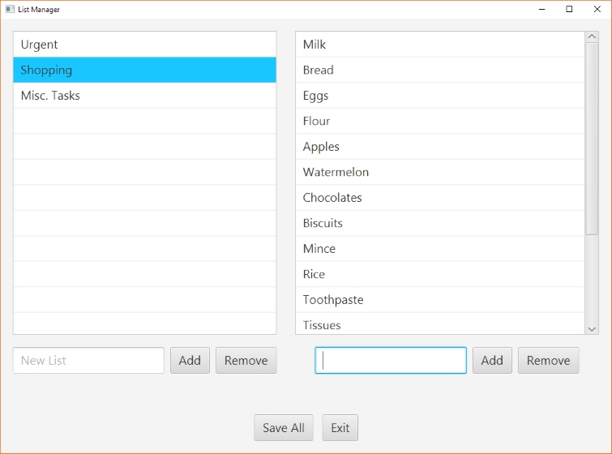
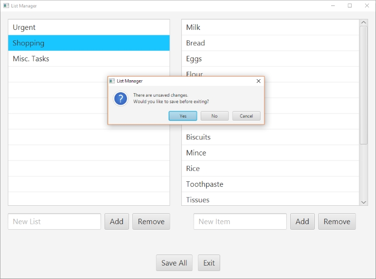

# ListManager

ListManager is an organisational tool. Users can create new lists and add items to those lists to keep track of things.

It has a range of features including confirmation dialogues to avoid accidental deletion and the ability to save.

## Installing

To use this program, download and run the ListManager.jar file in the dist folder (you will need Java installed on your system).

## Development

This project was coded in Java using Java FX with object-oriented design. It uses the MVC architecture with FXML for the view.
